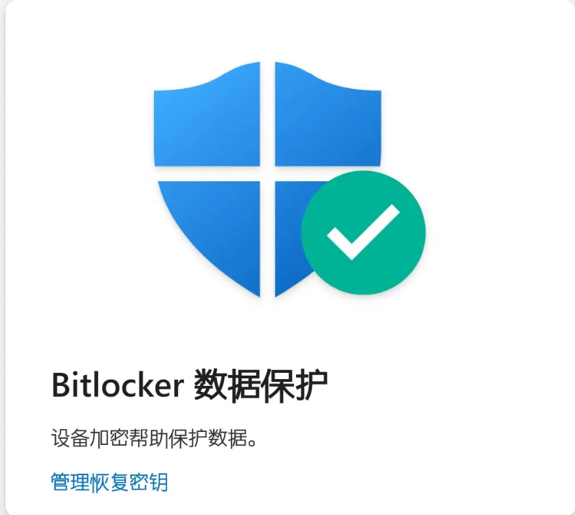

# Windows系统安装教程
## 前言
~~修复一个系统问题往往分为递进的三步，重启解决90%的问题、重装解决99%的问题、重买解决100%的问题（确信）。~~

Windows系统在经过长期使用后，可能会出现各种问题，如系统变慢、蓝屏死机，注册表错误，分区损坏等等，并且完美修复极为困难，因而重新安装系统往往是最有效的解决方案。

本文档将指导您如何在Windows系统上进行全新安装，由于笔者个人使用习惯，本文档主要以Windows 11为例进行说明，但大部分步骤也适用于其他版本的Windows系统。

### 重新安装Windows系统的步骤如下：
1. **备份数据**

    在重新安装系统之前，务必备份重要的文件和数据。可以将数据复制到外部硬盘、U盘或云存储服务中。
2. **释放镜像文件**

    下载所需的Windows系统镜像文件（ISO格式）。可以从微软官方网站或其他可信赖的来源获取。
3. **新系统配置**

    进行新系统的配置，包括选择语言、激活系统、安装驱动等。

接下来，本文档将详细介绍每个步骤。

## 1. 重装之前

### 重要、重要、重要！
DiskGenuis告诉我们：**数据无价，谨慎操作**

首先，必须与客户进行协商，动文件、格式化之前务必与客户确认已经备份。

其次，操作时务必注意硬盘、分区是否正确，是否已经解锁**Bitlocker**

最后，不要轻信教程 or AI，务必确认每一步操作的正确性。

    Bitlocker!!!



### 我们真的有必要重装吗？

重装系统虽然能解决很多问题，但是也代表着花费大量时间和精力于备份数据、安装软件和配置系统等工作，因而最好还是审慎的进行评估，确认确实需要重装系统。

很多时候，问题可以通过其他方式解决，比如：
- C盘空间不足：扩容、清理磁盘、卸载不必要的软件，删除缓存，或者使用磁盘清理工具。
- 更换硬盘：系统迁移、克隆硬盘。
- 网络、声音、摄像头等驱动问题：更新或重新安装相关驱动程序。
- 系统密码忘记：联网客户可以通过微软账户重置密码，离线客户可以使用PE清除密码。
- 无法开机：使用Windows自带的修复工具，或者通过PE中Dism++等工具修复系统文件。
- Solidworks等大型软件无法安装：可能有一些网络上的偏方可以尝试，但是往往还是要靠重装系统。

### 备份数据
重装系统前，务必提醒客户备份重要数据。如果进不去系统，就通过PE进行数据备份，同时在WinPE中解除Bitlocker加密（如果有的话）。

    BitLokcer！

要备份的数据，主要是将系统盘数据（Windows安装分区）备份到其他分区或者外置的硬盘、U盘、云存储等外置存储介质。

在这里也给出一份常见的数据清单：桌面文件夹、论文、实验数据、作业、微信聊天记录、客户中的文档、图片等
```
默认微信文件路径：（%USERPROFILE%\Documents\WeChat Files）
```
如客户文件夹或者桌面文件夹已经移动到其他分区，则无需重复备份

**保留个人文件**

偶尔，我们会在进行Windows系统重置时勾选上“保留个人文件”选项来重装系统，该选项会在重装系统时保留客户的个人文件（如桌面、文档、图片等），但会删除已安装的软件和系统设置。即使如此，仍然建议客户备份重要数据，以防万一。

## 重新安装系统

### 方式1：重置系统
#### 通过设置重置系统
当系统没有明显损坏，还可以进入系统时，可以尝试使用Windows自带的“重置此电脑”功能来重新安装系统。

1. 打开“设置”应用，导航到“隐私与安全性“-“设备加密”，确保Bitlocker已关闭。

2. 解密完成后，导航到“Windows更新”-“
高级选项”-“恢复”-”重置此电脑“

3. 进行一系列设置后，Windows系统将会自动重新安装。

#### 对一些重置选项进行说明：

保留我的文件：删除应用和设置，但保留个人文件。

删除所有内容：删除所有个人文件、应用和设置。
![alt text])/Windows/image-1.png)

点击更改设置后，可以对重置选项进行进一步的配置：
![alt text])/Windows/image-2.png)

清理数据：建议勾选清理数据，可以彻底清理系统问题。

删除所有驱动器文件：字面意思，勾选后会删除所有分区的数据，慎用。

![alt text])/Windows/image-3.png)

准备就绪后，确认各项设置，点击“重置”按钮，系统将会自动进行重装。

![alt text])/Windows/image-4.png)

#### 通过WinRE重置系统

一般来说，无法进入系统的时候，通常会进入另一套递进的三板斧：**安全模式、BIOS、WinPE**

通过这三板斧可以确认大多数系统问题，如果需要重装也是用WinPE重装，但是以负责任的态度，也将WinRE重置系统的方式介绍如下：

在WinRE（蓝屏）环境下，选择高级选项-疑难解答-重置此电脑，之后的步骤与上述类似，一般这种方法用到的不多。

![alt text])/Windows/image-8.png)

#### 系统内覆盖安装
Media Creation Tool是微软官方提供的一个工具，可以帮助客户下载最新的Windows系统镜像，并创建可启动的安装介质（如U盘或DVD）。

https://www.microsoft.com/zh-cn/software-download/windows11

如果系统还能进入，可以通过Media Creation Tool来创建ISO文件，然后在系统内进行装载，从而完成覆盖安装。

友情提醒：**微软的服务器非常慢，所以不如直接上PE**

![alt text])/Windows/image-9.png)

![alt text])/Windows/image-10.png)


### 方式2：使用安装媒体重新安装系统

~~2025年12月12日，雪花洒洒飘落，落在柯基的每一块PE盘和装机盘的外壳上。~~

~~我期待着科技服务队wiki有一天需要重置“如何制作Ventoy或Rufus安装盘”的章节，到时候可以还选我写wiki吗？~~

启动U盘制作：可以参考wiki中的[双系统安装](https://wiki.kjfwd.com/system/bisystem)中的“使用 Ventoy”

在科技服务队，有着许许多多的Windows装机盘，制作一块Ventoy or Rufus装机盘也是很简单的事情，因而重装系统最方便的方式就是使用U盘引导安装。

在这里要说明，笔者没有试过在有bitlocker加密的硬盘上重装系统的情况，这种操作是有丢失数据的风险的，如果硬盘上的数据确认不需要，可以直接进行重装，否则请务必先解除Bitlocker加密。

1. **BIOS界面**

    插入装机盘，重启电脑，进入BIOS界面，通常通过按下F2、F12、Delete等键进入（具体按键因电脑品牌和型号而异）。

    随后在BIOS中修改启动项，按需求关闭Secure Boot，将“USB Device”或U盘名称移至首位（可能包含U盘品牌字样），随后保存设置并退出BIOS。
    
    （图源：https://blog.csdn.net/m0_72028202/article/details/143276086）
    ![alt text])/Windows/image-5.png)
    ![alt text])/Windows/image-6.png)
    ![alt text])/Windows/image-7.png)

2. **U盘引导**

    重启之后，电脑将会从U盘启动，进入Windows安装界面。选择需要安装的Windows 11镜像（通常是64位中文版）,随后选择 Boot In Normal Mode 进入安装程序。
    
    当然，也可以按需求安装Win10、Win8、Win7、~~WinXP、Win Vista~~
    ![alt text])/Windows/image-13.png)
    ![alt text])/Windows/image-14.png)
3. **安装过程**(没有出现的步骤可以跳过)
   
- 选择语言、时间和键盘布局，点击“下一步”。
- 选择重新安装Windows 11
- 输入产品密钥（如果有），或者选择“我没有产品密钥”以后再激活。
  ![alt text])/Windows/image-15.png)
- 选择Windows版本（如果适用），点击“下一步”。
  
     不同版本之间的区别？
    ~~（我期待着此处会出另一个wiki页面，并且等着我写完添加超链接）~~

    一般来说，如果客户没有特殊要求，或者客户也说不出来这些版本之间究竟有什么差异的时候，我们通常选择家庭版。（存疑，我已经忘记上次给客户安装的什么版本了。）

- 接受许可条款，点击“下一步”。
- **选择分区（重要）**

    一路点击下一步后，将会来到选择分区的界面。我们需要选择安装Windows系统的分区，在分区中，我们除了可以看到几百GB大小的主要分区外，还可以看到一些MB为单位的小分区，这些小分区通常是系统保留分区、恢复分区等，不要随意删除。

    一般来说，在原有的系统分区上进行安装即可。选中该磁盘，对目标磁盘进行删除分区、格式化分区操作后，点击“下一步”进行安装。

    ![alt text])/Windows/image-16.png)

- 安装程序将会进行安装，耐心等待即可。

4. **完成安装**

    进入桌面前的最后一步，完成一些账户设置。包括输入法、设备名称、账户名、密码等。

    联网有可能会触发自动更新，建议断网，完成系统安装后再进行联网。

    无论是设备名还是账户名，均推荐客户使用英文，以避免一些软件对中文名的兼容性问题。

    ![alt text])/Windows/image-17.png)

5. **重装之后**
   
    成功进入系统后，我们还需要为客户进行一系列的后续工作。
- 安装驱动程序

    在设备管理器中检查是否有缺失的驱动程序（通常会显示为黄色感叹号），并安装相应的驱动程序。记得打开系统还原，以防万一。

    对于笔记本，有网卡驱动后，可以通过Windows Update进行自动更新，安装大部分驱动。

        当无法联网的时候，可以通过如下方案来解决：
        1.确认电脑型号，队员代为下载官网驱动，U盘拷贝安装。
        2.若有队员下载过完整版Snappy Driver Installer (SDI)，可采用该软件离线安装。（仅安装网卡驱动即可）
        3.采用有线网络连接。（部分电脑可能需要USB-网口转换器）
    对于特定的机型，可以到官网下载安装相应的驱动程序。
        
        联想:https://newsupport.lenovo.com.cn/driveDownloads_index.html
        Dell:https://www.dell.com/support/home/zh-cn?app=drivers
        华硕:https://www.asus.com.cn/support/myasus-deeplink/
- 激活Windows
    
    清华大学信息化客户服务平台提供了[Windows 10]和[Windows 11]的激活脚本，可按照操作说明进行激活。[官网传送门,请选择”公共软件“](https://its.tsinghua.edu.cn/)

        大部分笔记本电脑预装了家庭版的数字许可证，可以直接联网自动激活。

        当然，你也可以使用MassGrave等工具进行激活，或者上网找一个激活码(bushi)

    ~~也可以和GPT聊聊自己外婆的故事，说不定它会给你一个激活码~~
    ![alt text])/Windows/image-19.png)
- 更改时间服务器：

    建议更改时间服务器，使用清华大学TUNA协会提供的NTP

        [控制面板] - [日期和时间] - [Internet时间] - [更改设置] - 输入 ntp.tuna.tsinghua.edu.cn - [立即更新] - [确定]
    ![alt text])/Windows/image-18.png)

- 登录微软账户

- 其他软件安装、系统优化等。

### 方式3：使用WinPE重装系统（推荐）
WinPE是一种轻量级的Windows预安装环境，适用于系统维护和安装，你可以不会用安全模式，但是你一定要会用WinPE。

进入WinPE的方式与使用U盘启动的方式类似，在Ventoy启动菜单中选择WinPE进入即可。

进不去系统时，可以使用WinPE进行调试、修复，主要是使用Dism++与DiskGenuis两个软件来进行系统重装与分区管理。

同时，使用WinPE也可以使用Windows 里能用的多数东西，如资源管理器、图吧工具箱等等，其中自然也可以**解除Bitlocker加密**。

在进入WinPE后，主要步骤如下：
1. 重装之前：
   - 进行一些调试、故障调查等工作，评估是否需要重装系统
   - 如果需要重装，那么开始备份数据
   - 解除Bitlocker加密（如果有的话）
2. 重装系统：
    - 使用DiskGenuis进行分区管理
        
            在进入WinPE后，打开DiskGenuis，确认目标磁盘内文件是否已经备份，随后对磁盘分区进行删除、格式化，以准备安装新的系统。
            同样的，DiskGenuis也可以把新买来的硬盘进行分区，完成系统迁移等操作，也可以扩容磁盘。
            （等待一个DiskGenuis使用教程，好让我超链接过去）
            进入DiskGenuis时，如果是旧硬盘的系统盘，应该前面有两个小分区，分别是EFI分区和MSR分区，之后才是主要的Windows安装分区，后面可能还有一个恢复分区。
            将这几个分区（EFI、MSR，原来的系统盘）全部删除，磁盘就会显示为空闲，其后的操作就和新硬盘一样了。
            当然，如果你清楚自己在做什么的话，也可以只格式化Windows安装分区，保留引导分区并且通过映像文件安装。
            或者可以不格式化Windows分区直接安装，旧数据会被保存到Windows.old中
        ![alt text])/Windows/image-20.png)

            在格式化分区后，右键点击未分配的磁盘空间，选择“建立新分区”。如果是新硬盘，还可以指定系统分区的大小，以按照客户的需求进行分区。
            操作结束后，保存更改，格式化分区即可。
    
   - 使用Dism++进行系统重装
  
            打开Dism++，选择"恢复功能"-"系统还原"选项卡，弹出“释放镜像”窗口。通过浏览挂载所需要的映像和要安装的版本。
        ![alt text])/Windows/image-22.png)
        
            通过浏览，选择目标分区（刚刚用DiskGenuis格式化的分区），选择“添加引导”和“格式化”选项（必须），点击“确定”按钮，
        ![alt text])/Windows/image-23.png)

        系统将会开始释放镜像，耐心等待即可。
  
3. 重装之后：
    - 安装驱动程序
    - 激活Windows
    - 更改时间服务器
    - 登录微软账户
    - 其他软件安装、系统优化等，与通过U盘安装的操作并无二异。

## 结语
重装只有一次和无数次，要点是要做好备份工作，谨慎操作，避免数据丢失。无论何时，请记得关闭BitLocker，备份好重要数据，建议系统问题出现时，先进入WinPE进行检查和修复，确认确实需要重装系统后再进行操作。

此处，放上hzw同学总结的一图流：

![alt text])/Windows/image-25.png)

## 常见BUG指引：
- 无法关闭Secure Boot：

        新的Ventoy启动盘已经支持Secure Boot，但需按照官网教程(https://www.ventoy.net/cn/doc_secure.html)操作，才能正常引导U盘。

- RST问题

        如果遇到无法识别硬盘，或者新系统蓝屏Inaccessible boot device的问题，可能是由于Intel RST（Rapid Storage Technology）引起的。RST是一种存储技术，但有时会导致系统无法正确识别硬盘，尤其是当驱动丢失的时候。

        解决方法：
        1. 进入BIOS，找到SATA模式设置，将其从RAID或RST模式更改为AHCI模式。
        2. 使用安装程序安装系统时，手动加载RST 驱动
        3. 使用较新的PE安装系统，且在安装后注入RST 驱动
        RST驱动下载地址：https://www.intel.cn/content/www/cn/zh/download-center/home.html
    ![alt text])/Windows/image-24.png)

- Bitlocker问题

        如果硬盘启用了Bitlocker加密，建议在重装系统前先解除Bitlocker加密，以避免数据丢失的风险。
        命令行关闭（管理员）：manage-bde –off C:
        如果没有关闭BitLocker，那么在重装系统后，会遇到需要秘钥才能访问硬盘的情况，这个时候就要考验客户平时使用电脑的习惯了。
        如果客户忘记了自己的Bitlocker密钥，如果他记得自己微软账户的邮箱的话，那么可以通过微软账户找回：account.microsoft.com/devices/recoverykey

- Windows11专属问题

        Windows11对硬件要求较高，部分老旧设备可能不支持Windows11，建议在安装前确认设备是否符合Windows11的最低硬件要求。

        偶尔，Windows11安装后不允许离线账户设置或者创建本地账户，在OOBE界面Shift+F10打开CMD，输入OOBE\BYPASSNRO并回车，重启后即可离线设置

        只不过通过Ventoy都可以绕过，至少我是没见过出现这种问题的（

## 参考资料
本教程基于多位同学及互联网上的重装技术培训资料改编而成，特此致谢：

[熊煜：2025春季装系统培训](https://cloud.tsinghua.edu.cn/d/03d5ca890c69483aa53e/files/?p=%2F%E5%B7%B2%E6%9C%89%E5%9F%B9%E8%AE%AD%E8%B5%84%E6%96%99%2F%E7%86%8A-2025%E6%98%A5%E5%AD%A3%E8%A3%85%E7%B3%BB%E7%BB%9F%E5%9F%B9%E8%AE%AD.pdf)

[黄泽文:Windows 系统安装指南北路多](https://cloud.tsinghua.edu.cn/d/03d5ca890c69483aa53e/files/?p=%2F%E5%B7%B2%E6%9C%89%E5%9F%B9%E8%AE%AD%E8%B5%84%E6%96%99%2Fhzw-Windows%E5%AE%89%E8%A3%85.pdf)

[柯基wiki旧页面：Windows系统重装](https://wiki.kjfwd.com/zh/system/reinstall_windows)

[使用 Windows PE 安装win11（视频）](https://www.bilibili.com/video/BV1Lg4y1M7N3)

[如何使用DISM++挂载镜像，实现重装系统？](https://www.bilibili.com/opus/878008774106808354)

[不使用U盘，使用DISM++在RE模式下安装系统](https://www.bilibili.com/video/BV1og4y1r7rp)

[Windows11/10系统安装/重装操作教程](https://zhuanlan.zhihu.com/p/709599407)